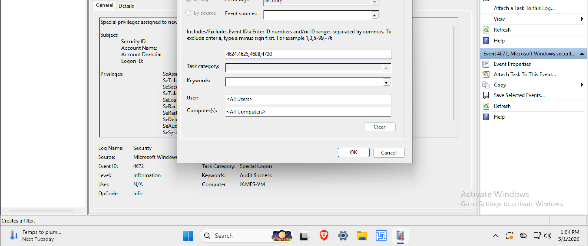
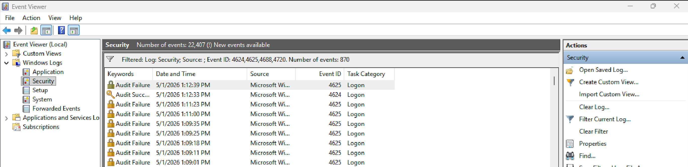
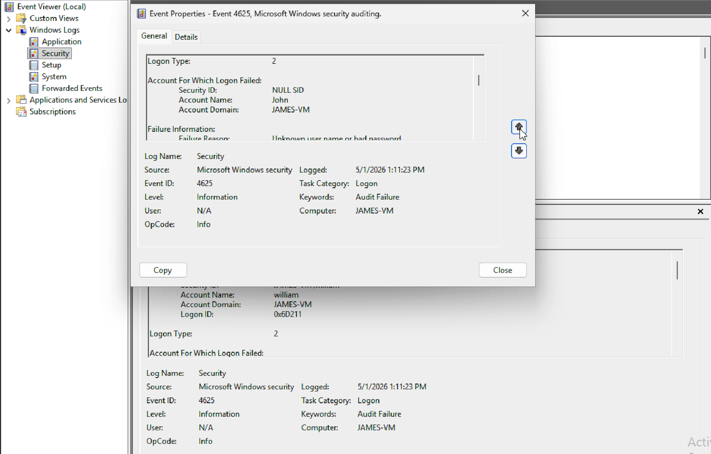
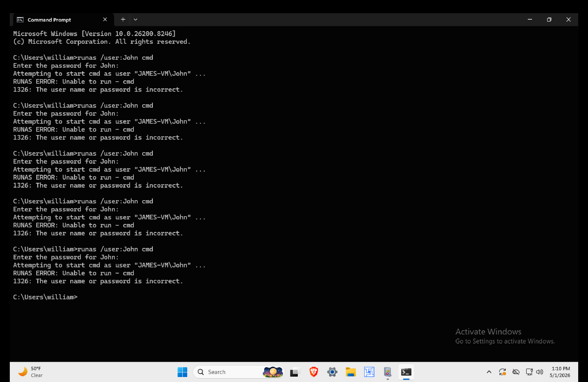

# Day 04 – SOC Tier 1 Incident Report: Windows Event Viewer Investigation

---

## Incident Summary

- **Incident Type:** Suspicious Windows System Activity Review
- **Severity:** Medium
- **Detection Method:** Windows Event Viewer Log Analysis
- **Tools Used:** Event Viewer (eventvwr.msc)
- **Status:** Investigated (Simulated Environment)

---

## Executive Summary

This investigation focused on analyzing Windows Security logs to detect suspicious authentication attempts, unauthorized account creation, and abnormal process execution.

The objective was to identify potential signs of brute-force attacks, unauthorized access, and malware execution patterns using Event Viewer logs.

---

## Affected System

- **System Type:** Windows Machine (Lab Environment)
- **Log Source:** Windows Security Logs
- **Scope:** Authentication + Process Monitoring

---

## Investigation Methodology

### 1. Log Source Access

- Opened Event Viewer using `eventvwr.msc`  
- Navigated to:
```

Windows Logs → Security

```
- Focused on authentication and system activity logs  

---

### 2. Filtered Security Events

Applied filter:

```

4624, 4625, 4720, 4688

```



This narrowed investigation to:

- Successful logins  
- Failed login attempts  
- New user account creation  
- Process execution events  

---

## Event Analysis

---

### 3. Failed Login Attempts (4625)

Event Type: **Authentication Failure**





- Detected multiple failed login attempts  
- Observed repeated username targeting behavior  
- Analyzed frequency and timing of failures  

### SOC Observations:
- Multiple failures in short time window indicate possible brute-force attempt  
- Repeated username suggests automated password guessing  

---

### 4. Brute Force Simulation Evidence

Event Type: **Command-Line Simulation**



- Demonstrates simulated attack generating failed login attempts  
- Confirms source of repeated 4625 events  

### SOC Observations:
- Controlled simulation validates detection logic  
- Useful for training and detection tuning  

---

## Detection Logic

Suspicious system behavior is identified when:

- Multiple failed logins occur in a short time (brute force pattern)  
- Successful login follows repeated failed attempts  
- New user accounts are created unexpectedly  
- Suspicious process execution occurs after authentication events  

---

## Attack Pattern Analysis

### Observed Behavioral Chain (Example)

```

4625 → 4625 → 4625 → 4624 → 4688

```

### Interpretation:

- Multiple failed login attempts  
- Successful login achieved  
- Followed by process execution  

👉 This pattern may indicate:

> Brute-force attack → Successful compromise → System execution

---

## MITRE ATT&CK Mapping

| Behavior              | Technique ID | Description              |
|----------------------|--------------|--------------------------|
| Brute Force Attempt  | T1110        | Credential Access        |
| Valid Accounts       | T1078        | Successful Login Abuse   |
| Create Account       | T1136        | Persistence              |
| Process Execution    | T1059        | Command Execution        |

---

## SOC Analyst Findings

- Evidence of repeated authentication attempts detected  
- Pattern consistent with brute-force simulation  
- Event logs confirm attack behavior replication  
- No real system compromise (lab-controlled activity)  
- Detection logic successfully validated  

---

## SOC Analyst Response

- Monitor repeated login failures (4625)  
- Investigate source of login attempts  
- Validate legitimacy of new user accounts  
- Review process execution logs for malware indicators  
- Escalate if pattern appears outside lab environment  

---

## Analyst Insight

Windows Event Logs are critical for detecting early attack stages. SOC analysts must correlate authentication events with process execution to identify full attack chains rather than isolated logs.

---

## Learning Outcome

This investigation demonstrates the ability to:

- Navigate Windows Event Viewer effectively  
- Filter and analyze security event logs  
- Detect brute-force attack patterns  
- Validate detection using simulation  
- Correlate system activity into attack chains  
- Apply SOC Tier 1 investigation methodology  

---

## Repository Structure

```

.
├── README.md
├── screenshots/
│   ├── event_viewer_filter.png
│   ├── 4625_brute_force.png
│   ├── 4625_event_details.png
│   ├── brute_force_simulation_cmd.png

```

---

## Conclusion

This analysis demonstrates how Windows Event Viewer can be used to detect suspicious authentication behavior and potential intrusion activity. By correlating login events and validating them through simulation, SOC analysts can confidently identify brute-force patterns and respond effectively.
```
