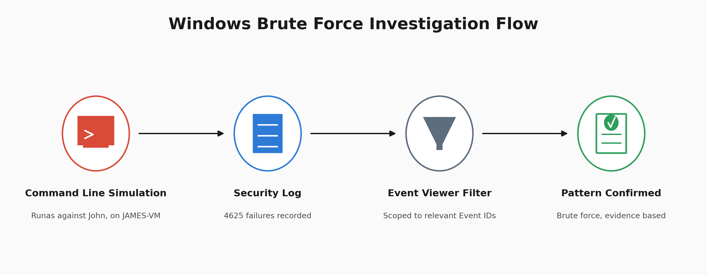

# Windows Event Log Investigation with Event Viewer

I investigated repeated Windows authentication failures in Event Viewer, traced the activity to a controlled command line simulation, and used the event details to determine what actually happened.



The investigation moved from a controlled authentication simulation into the Windows Security log, where Event Viewer was used to isolate and inspect the relevant authentication events.

## At a Glance

| Field | Detail |
| --- | --- |
| Activity | Repeated Windows authentication failures |
| Investigation Type | Windows Security event investigation |
| Detection Method | Event Viewer filtering and event detail analysis |
| Tools Used | Event Viewer, `eventvwr.msc`, Command Prompt |
| Host | `JAMES-VM` |
| Investigated Account | `John` |
| Primary Event ID | `4625` |
| MITRE ATT&CK | `T1110` Brute Force |
| Outcome | Repeated failed logons traced to a controlled lab simulation |

## What Happened

Windows Security logs were reviewed to investigate repeated authentication failures on `JAMES-VM`.

The investigation focused on identifying the relevant Windows Event IDs, inspecting the account information inside the events, and tracing the repeated failures back to the activity that generated them.

## Log Source Access

Event Viewer was opened with:

```text
eventvwr.msc
```

The investigation was scoped to:

```text
Windows Logs → Security
```

This provided the Windows Security events needed for the authentication investigation.

## Filtering the Security Log

### Action

I filtered the Security log for authentication, account creation, and process execution Event IDs.

```text
4624, 4625, 4720, 4688
```

### Evidence


### Analyst Reasoning

Filtering the Security log reduced the amount of unrelated Windows activity and provided a focused view of the Event IDs relevant to the investigation.

The filter included:

`4624` for successful logons

`4625` for failed logons

`4720` for account creation

`4688` for process creation

These Event IDs defined the investigation scope. Their inclusion in the filter does not mean every behavior was observed during the investigation.

### Verdict

The Security log was successfully scoped to the Windows events relevant to authentication and follow on investigation.

## Investigating Event ID 4625

### Action

I reviewed the filtered Security log for repeated Event ID `4625` failed logons.

### Evidence


Multiple `4625` events appear within a short period in the filtered Security log.

I then opened an individual event to inspect the authentication details.


The event details identify:

```text
Event ID: 4625
Account Name: John
Computer: JAMES-VM
Logon Type: 2
Failure Reason: Unknown user name or bad password
```

### Analyst Reasoning

The event list established that the failures were repeated.

Opening the individual `4625` event established which account was involved and provided the Windows authentication details behind the event.

This moved the investigation from recognizing repeated failures to identifying the account associated with them.

### Verdict

Repeated failed authentication attempts were recorded against `John` on `JAMES-VM`.

## Simulation Evidence

### Action

I compared the Windows authentication events with the command line activity used to generate the lab behavior.

### Evidence


The Command Prompt shows repeated attempts using:

```text
runas /user:John cmd
```

The attempts returned:

```text
1326: The user name or password is incorrect.
```

### Analyst Reasoning

The command line evidence provides the known cause of the repeated authentication failures.

The account targeted by the simulation matches the `John` account identified inside the `4625` event details.

This allowed the Windows telemetry to be correlated with the controlled activity that generated it.

### Verdict

The repeated `4625` failures against `John` were generated by the documented command line simulation on the lab host.

## Authentication Correlation

The filtered Security log also contained successful logon activity.

A nearby `4624` should not automatically be interpreted as the brute forced account successfully authenticating. The account information inside the event must match the account involved in the preceding failures.

In this investigation, the nearby successful authentication belonged to `william`, while the repeated failures were associated with `John`.

No evidence reviewed in this investigation established a successful authentication for `John`.

No `4688` process execution evidence was available to establish follow on execution associated with the investigated account.

### Verdict

The available evidence supports repeated failed authentication against `John`. It does not establish that `John` successfully authenticated or that follow on process execution occurred.

## Detection Logic

The investigation suggests several useful Windows authentication detection conditions:

```text
Multiple 4625 events against the same account within a defined time window

4624 success for the same account following repeated 4625 failures

4720 account creation that requires validation against expected administrative activity

4688 process execution following suspicious authentication activity
```

These are investigation and detection pivots.

Only the repeated `4625` activity against `John` is confirmed by the evidence presented in this project.

## MITRE ATT&CK Mapping

| Observed Behaviour | Technique ID | Technique |
| --- | --- | --- |
| Repeated authentication attempts against a single account | T1110 | Brute Force |

The investigation filter also included Event IDs related to successful authentication, account creation, and process execution.

Those behaviors are not mapped as confirmed activity because the available project evidence does not establish them as part of the simulated authentication activity.

## Investigation Findings

The investigation established:

* Multiple Event ID `4625` failures were recorded.
* The inspected failed logon identified the account as `John`.
* The activity occurred on `JAMES-VM`.
* The command line simulation repeatedly targeted `John`.
* The simulation returned incorrect username or password errors.
* The Windows events could therefore be correlated with a documented lab activity.
* A nearby successful logon was associated with a different account.
* The available evidence did not establish a successful authentication for `John`.
* No `4688` evidence was available to demonstrate follow on process execution associated with the investigated activity.

## Analyst Conclusion

Repeated Windows authentication failures were confirmed against `John` on `JAMES-VM`.

The Event Viewer evidence was correlated with the documented `runas` simulation that generated the failed authentication attempts.

The available evidence supports repeated password guessing behavior generated during the controlled lab simulation. It does not establish a successful authentication for `John` or follow on process execution.

**Verdict:** Controlled repeated authentication failure activity confirmed through Windows Security telemetry.

## Recommended Response

In a production SOC investigation, I would:

* Alert on repeated `4625` activity against the same account within a defined time window.
* Inspect the account, logon type, source information, and failure reason inside the events.
* Search for a later `4624` involving the same account.
* Review relevant process execution telemetry when suspicious authentication succeeds.
* Validate unexpected account creation against approved administrative activity.
* Escalate when authentication and follow on evidence indicate unauthorized access.

## Windows Security Event ID Quick Reference

| Event ID | Category | Description | Investigation Value |
| --- | --- | --- | --- |
| 4624 | Authentication | Successful logon | Determine whether authentication succeeded |
| 4625 | Authentication | Failed logon | Investigate repeated authentication failures |
| 4720 | Account Management | User account created | Validate unexpected account creation |
| 4722 | Account Management | User account enabled | Review unexpected account activation |
| 4732 | Group Management | Member added to local security group | Investigate unexpected privilege changes |
| 4688 | Process | New process created | Identify execution following suspicious activity |
| 4698 | Task Scheduler | Scheduled task created | Investigate scheduled task creation |
| 7045 | System | New service installed | Investigate unexpected service installation |

## SOC Investigation Value

This project demonstrates:

* Navigating the native Windows Security log
* Filtering Event Viewer by relevant Event IDs
* Investigating Event ID `4625`
* Reading account information inside individual Windows events
* Correlating Windows telemetry with the activity that generated it
* Distinguishing one account's failed authentication from another account's successful logon
* Separating observed behavior from additional investigation pivots
* Mapping verified authentication behavior to MITRE ATT&CK

## Lessons Learned

The most useful part of this investigation was checking the account information inside the authentication events.

The filtered view contained both failed and successful logon activity, but the successful event belonged to a different account. Matching the account name across the events prevented the nearby `4624` from being incorrectly attributed to `John`.

This reinforced that Windows Event IDs provide the event category, while the fields inside the event provide the context needed to interpret what happened.

## What I Would Improve

I would extend this investigation by correlating `4625` and `4624` events by account name within a defined time window. That would make it easier to identify when repeated failures against one account are followed by a successful authentication for that same account.

I would also collect and correlate process execution telemetry when authentication succeeds. That would allow the investigation to move from authentication analysis into determining what occurred after logon.

## Repository Structure

```text
.
├── README.md
└── screenshots/
    ├── 00_architecture.png
    ├── event_viewer_filter.png
    ├── 4625_brute_force.png
    ├── 4625_event_details.png
    └── brute_force_simulation_cmd.png
```

---

## Author

**William Gokah**

SOC Analyst Portfolio

[](https://linkedin.com/in/WilliamInCyber)

[](https://x.com/WilliamInCyber)
