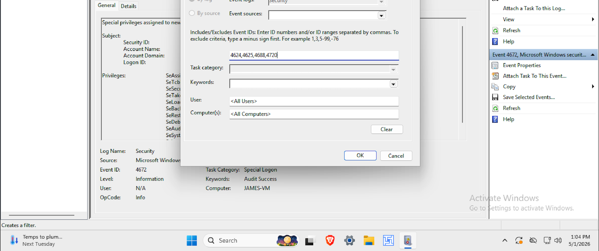
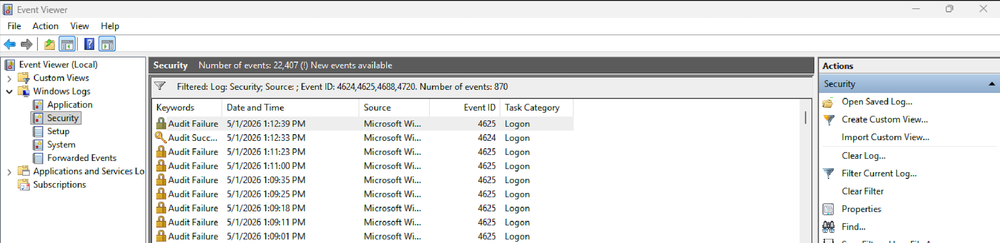
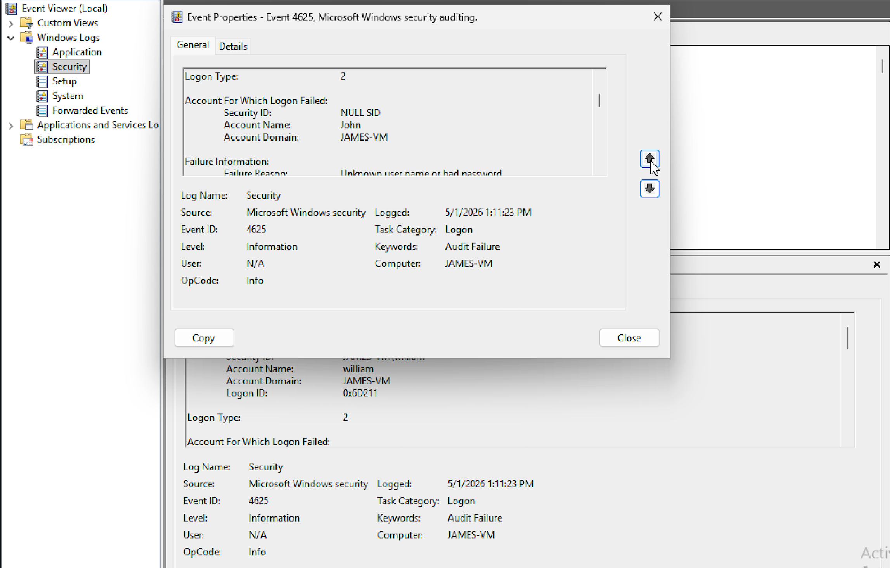
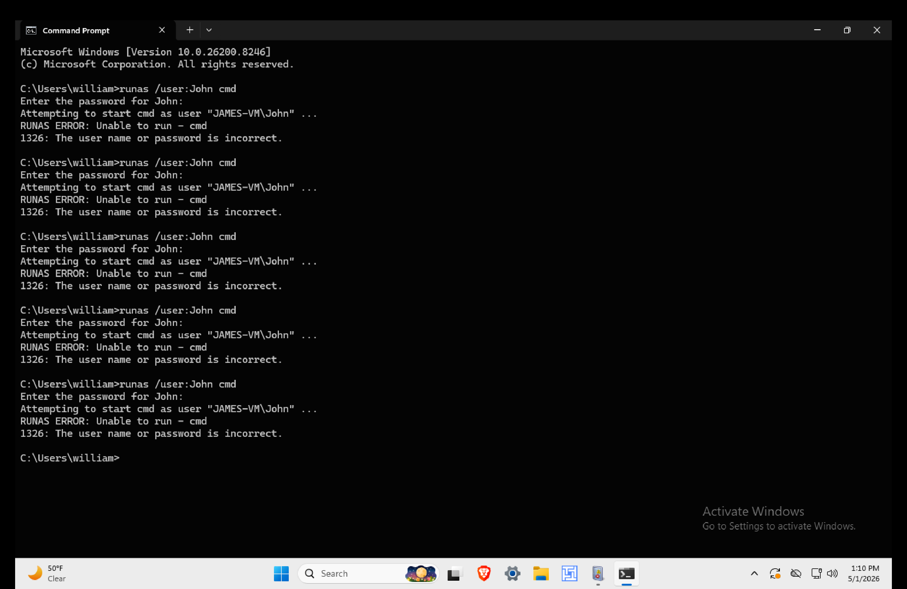

# Windows Event Log Investigation with Event Viewer

Reading Windows Security logs the way a Tier 1 analyst has to read them: filtering to the Event IDs that matter, spotting a brute force pattern, and chaining events together instead of triaging them one at a time.

## At a Glance

| Field | Detail |
| --- | --- |
| Alert Type | Suspicious Windows authentication activity |
| Severity | Medium |
| Detection Method | Windows Security log analysis in Event Viewer |
| Tools Used | Event Viewer, eventvwr.msc |
| Scope | Authentication and process execution events |
| Outcome | Brute force pattern identified, activity confirmed as controlled lab simulation |

## What Happened

Windows Security logs were reviewed for signs of brute force authentication, unauthorised account creation, and abnormal process execution.

The core skill here is not finding a bad event. It is knowing that a single event tells you almost nothing, and the story lives in the sequence.

## Log Source Access

Event Viewer was opened via eventvwr.msc and the investigation scoped to Windows Logs, then Security. That is where authentication and account management activity lands on a Windows host.

## Filtering the Noise



The Security log records a huge volume of routine activity. Reading it unfiltered is how analysts miss things.

Filter applied:

```
4624, 4625, 4720, 4688
```

That narrows thousands of events down to four questions: who got in, who failed to get in, who was created, and what ran.

## Failed Login Attempts, Event ID 4625





Multiple authentication failures were detected against the same username, clustered in a short time window.

The username repetition is the tell. A real user who forgets a password fails two or three times and stops. An automated tool fails against the same account relentlessly because it is working through a list, not remembering.

Frequency and timing were analysed on the event details rather than the summary count, confirming the failures were machine paced.

## Simulation Evidence



The failed logon events were generated by a controlled command line simulation on the lab host.

This is the honest part of the lab. The 4625 events are real Windows events, but the source is documented, so the detection logic is validated against a known cause rather than assumed from ambiguous data.

## Detection Logic

Suspicious behaviour on a Windows host is flagged when:

Multiple failed logons hit the same account in a short window.

A successful logon follows a run of failures.

A new account appears without a change request behind it.

Process execution follows shortly after an authentication event.

## Attack Chain Analysis

The pattern that matters is the sequence, not the events:

```
4625 → 4625 → 4625 → 4624 → 4688
```

Read left to right: repeated failures, then a success, then something executed.

Each of those events is unremarkable alone. 4624 fires thousands of times a day on a healthy host. 4688 fires constantly. It is only the order that turns them into a story, and that story is guessing, getting in, and doing something.

That transition from 4625 to 4624 is the moment a scan becomes an incident. An analyst who only counts failures never sees it.

## MITRE ATT&CK Mapping

| Behaviour | Technique ID | Description |
| --- | --- | --- |
| Repeated authentication failures | T1110 | Brute force |
| Successful logon after failures | T1078 | Valid accounts |
| Unexpected account creation | T1136 | Create account, persistence |
| Post logon process execution | T1059 | Command and scripting interpreter |

## Analyst Conclusion

Repeated authentication failures confirmed against a single account.

Pattern consistent with automated password guessing.

Source traced to a documented lab simulation, so no compromise occurred.

Detection logic validated against a known cause, which is the point of running it in a lab first.

## Recommended Response

Alert on 4625 volume thresholds per account rather than reviewing them by hand.

Trace the source of the login attempts before assuming they are noise.

Validate every 4720 account creation against an approved change.

Review 4688 process execution following any successful logon that came after a failure run.

Escalate immediately if this sequence appears outside a controlled environment.

## Windows Security Event ID Quick Reference

| Event ID | Category | Description | Why It Matters |
| --- | --- | --- | --- |
| 4624 | Authentication | Successful logon | Off hours, unfamiliar source |
| 4625 | Authentication | Failed logon attempt | Repeats mean brute force |
| 4720 | Account management | New user account created | Was it authorised |
| 4722 | Account management | User account enabled | Dormant account woke up |
| 4732 | Group management | User added to security group | Privilege escalation |
| 4688 | Process | New process created | What actually ran |
| 4698 | Task scheduler | Scheduled task created | Persistence mechanism |
| 7045 | System | New service installed | Common malware install path |

## What This Lab Demonstrates

Navigating the Windows Security log and filtering it to a purpose instead of scrolling it.

Recognising brute force by pacing and username repetition, not raw count alone.

Correlating authentication events with process execution into an attack chain.

Validating detection logic against a known, documented cause.

Mapping each stage of the chain to MITRE ATT&CK.

## Repository Structure

```
.
├── README.md
├── screenshots/
│   ├── event_viewer_filter.png
│   ├── 4625_brute_force.png
│   ├── 4625_event_details.png
│   ├── brute_force_simulation_cmd.png
```

---

[](https://linkedin.com/in/WilliamInCyber)
[](https://x.com/WilliamInCyber)
